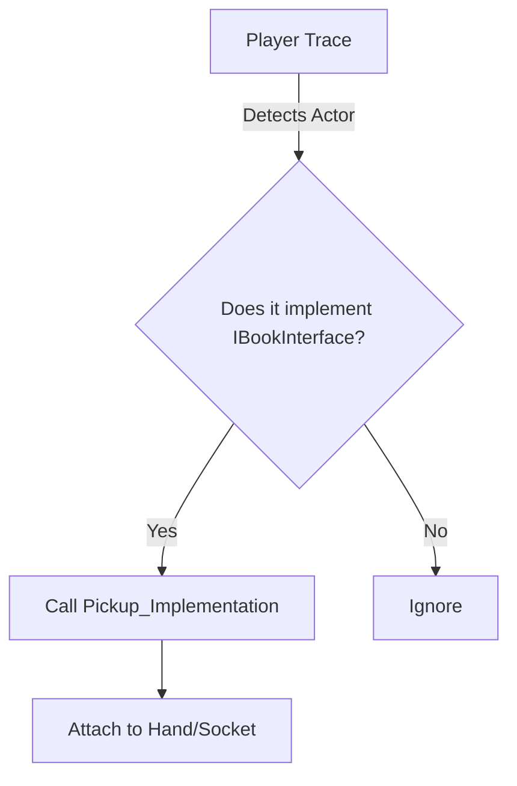
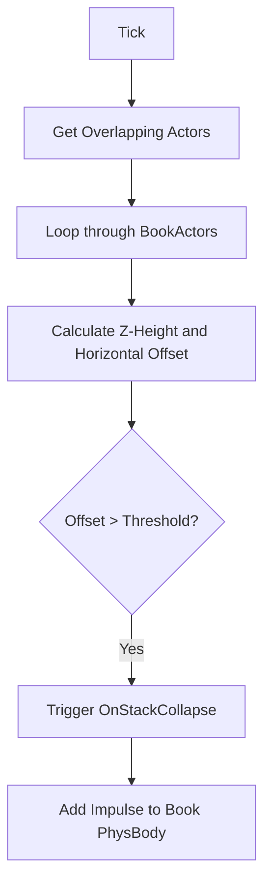
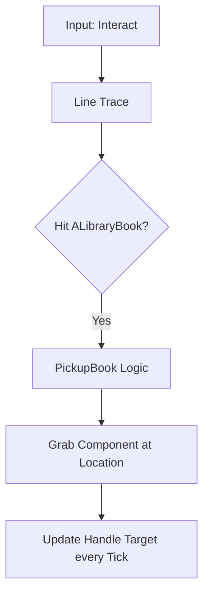

# Library Simulator Architecture Walkthrough

This document explains the core architecture and how to implement the Blueprint logic for the library management system.

## 1. Book Interaction Flow
The `ALibraryBook` actor implements `IBookInterface`.

````carousel

<!-- slide -->
### Interaction Functions
- **Pickup**: Attach the book to the player's skeletal mesh socket and disable physics.
- **CheckStatus**: Trigger a UI overlay showing `BookData.Title` and `BookData.Status`.
- **ApplyRepair**: If `Status != Normal`, set `Status` back to `Normal` and play a "Cleaning" animation.
````

## 2. Physics-based Stacking Logic
The `UStackStabilityComponent` handles the "Collapse" event.

````carousel

<!-- slide -->
### Stability Variables
- **HeightThreshold**: Maximum number of books before the stack becomes unstable.
- **StabilityThreshold**: Max horizontal distance (CM) from the base book's center before falling.
````

## 3. PC System & UI
The `ALibraryPC` acts as a database bridge.

- **SearchBook**: Use a `Filter` node in Blueprint to match the string against `LibraryDatabase`.
- **UpdateDisplay**: Binds the `FBookData` to the Widget text fields.

## 4. Mission/Task Manager
The `ALibraryTaskManager` manages game state.

- **SpawnMission**: Uses `SetTimerByFunctionName` in `BeginPlay`. Every 60 seconds, it picks a random `FMissionData` and displays it on the HUD.
- **Buried in Books**: 
    - When a book is placed in the "Returns" zone, call `AddBookToQueue()`.
    - If `CurrentReturnQueueSize >= MaxReturnQueueSize`, call the `OnGameOver()` Blueprint event.
    - `OnGameOver()` triggers the "Buried in Books" sequence (e.g., spawning falling book actors globally).

## 5. Advanced Systems (Character & AI)

### Character Interaction & Carrying
The `ALibraryCharacter` uses a `UPhysicsHandleComponent` for realistic book interaction.

````carousel

<!-- slide -->
### Carry Logic
Instead of simple attachment, `PhysicsHandle` allows the book to:
- **Sway**: Move slightly behind the hand when turning quickly.
- **Collide**: Bump into shelves or other books if the player isn't careful.
- **Drop**: If the distance between the hand and the handle exceeds a limit, the book is dropped.
````

### Patron (Villain) AI Pattern: "The Disorganizer"
Patrons move between shelves and randomly mess up the library state.

````carousel

<!-- slide -->
### Action Patterns
1. **Disorganize**: The AI finds a book with `bIsBeingRelocated = false`, sets it to `true`, and moves it to a shelf with a different `CategoryID`.
2. **Noise**: Every 30 seconds, a "Rude" Patron has a 20% chance to play a loud audio clip. If the player doesn't "Shush" them within 10 seconds, the "Mission Manager" adds a penalty.
````
